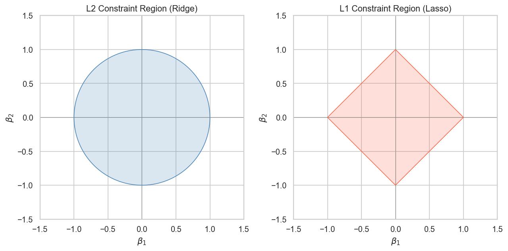
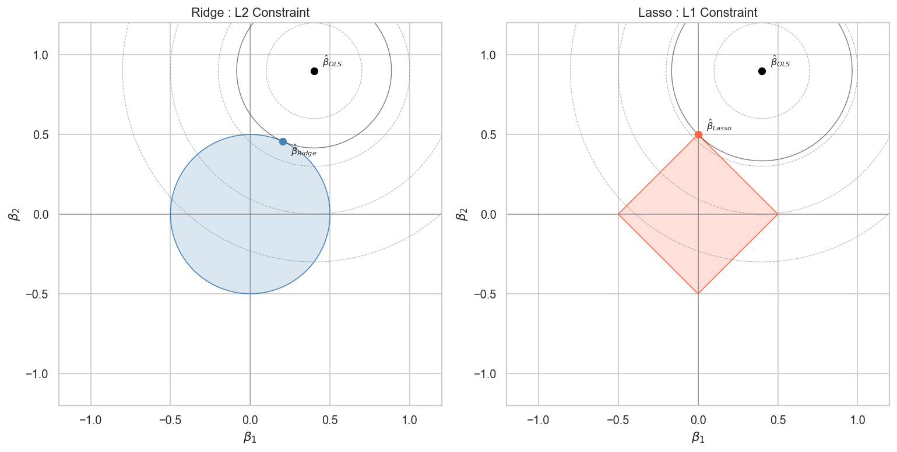
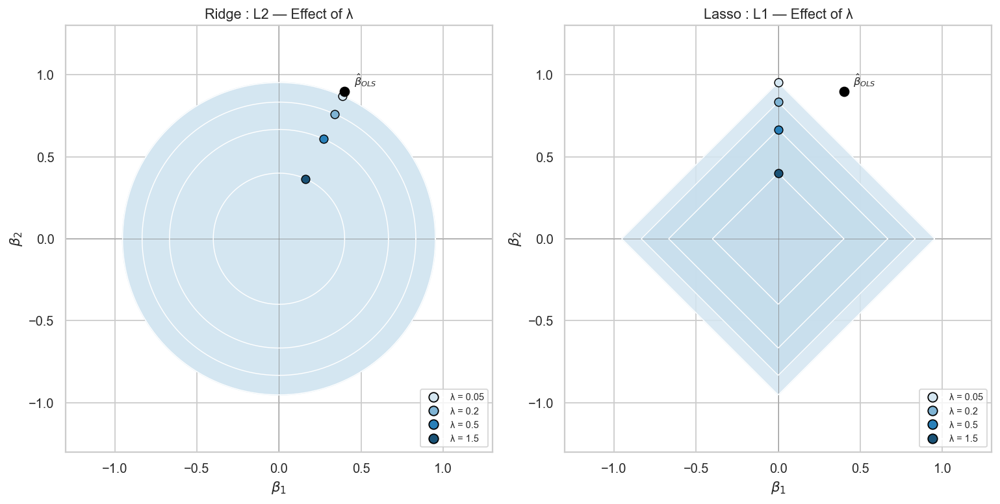
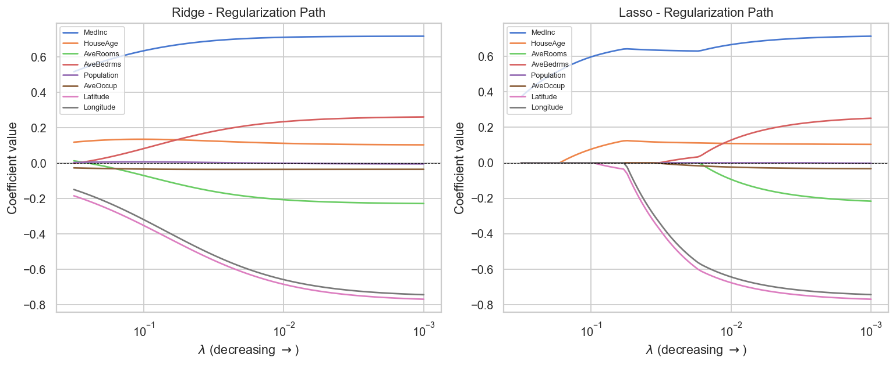

# L1 vs L2 Regularization - A Geometric Explanation

> **Why does Lasso produce exact zeros and Ridge does not?**
> The answer is purely geometric.

---

## Overview

Ridge and Lasso both penalize the OLS loss function to shrink coefficients. Their formulas differ by a single norm:

$$\text{Ridge:} \quad \hat{\beta} = \arg\min_{\beta} \left[ \frac{1}{n} \sum_{i=1}^{n} (y_i - \hat{y}_i)^2 + \lambda \|\beta\|_2^2 \right]$$

$$\text{Lasso:} \quad \hat{\beta} = \arg\min_{\beta} \left[ \frac{1}{n} \sum_{i=1}^{n} (y_i - \hat{y}_i)^2 + \lambda \|\beta\|_1 \right]$$

This notebook builds the full geometric intuition behind this difference and confirms it empirically on the California Housing dataset - **using NumPy only, no ML library for estimation**.

---

## Key Insight

Regularization is equivalent to constrained optimization: find the point inside a budget region that minimizes the MSE. The shape of that region determines everything:

| Penalty | Constraint region | Boundary | Exact zeros? |
|---------|-------------------|----------|--------------|
| L2 (Ridge) | Circle / sphere | Smooth, no corners | Never |
| L1 (Lasso) | Diamond / cross-polytope | Corners on the axes | Yes - corners attract the solution |

The MSE ellipses expand outward from the OLS solution. When they first touch the L1 diamond, they almost always hit a corner - where one coefficient is exactly zero. With the smooth L2 circle, any boundary point is equally likely, so exact zeros never appear.

---

## Contents

| # | Section | What you will learn |
|---|---------|---------------------|
| 1 | The Optimization Problem as Geometry | MSE as a family of ellipses; OLS as their center |
| 2 | Regularization as Constrained Optimization | Equivalence between penalized and budget formulations |
| 3 | Constraint Regions: L1 vs L2 | Visual comparison of the circle and the diamond |
| 4 | Why Lasso Produces Exact Zeros | Geometric proof via corners and tangent ellipses |
| 5 | The Role of λ | How shrinking the budget moves the solution |
| 6 | Empirical Verification on California Housing | Ridge and Lasso paths from scratch; entry-λ per feature |
| 7 | Practical Implications | When to use Ridge, Lasso, or Elastic Net |
| 8 | Conclusion | The geometry was always the explanation |

---

## Visualizations

### Constraint Regions


*Left: L2 ball (smooth circle). Right: L1 ball (diamond with corners on the axes).*

### Geometric Solution


*The regularized solution is where the smallest MSE ellipse touches the constraint region. The L1 corner captures the solution and sets one coefficient to zero.*

### Effect of λ


*As λ increases, the constraint budget shrinks and the solution is pulled further from β̂_OLS.*

### Regularization Paths


*Ridge never reaches zero. Lasso progressively eliminates features in order of importance.*

---

## Implementation

Both estimators are implemented from scratch with NumPy.

**Ridge** - closed-form solution:

$$\hat{\beta}_{Ridge} = \left(\frac{1}{n}X^T X + \lambda I\right)^{-1} \frac{1}{n}X^T y$$

**Lasso** - coordinate descent with soft-thresholding:

$$\hat{\beta}_j \leftarrow \mathcal{S}\!\left(\frac{X_j^T r_j}{n},\ \lambda\right) \cdot \frac{n}{\|X_j\|^2}, \qquad \mathcal{S}(z, \lambda) = \text{sign}(z)\max(|z| - \lambda, 0)$$

Warm starting is used across the λ grid for faster convergence.

---

## Empirical Results (California Housing, 8 features)

Feature entry order into the Lasso path (highest λ = most important):

| Feature | Entry λ | Interpretation |
|---------|---------|----------------|
| MedInc | 0.316 | Strongest predictor of price |
| HouseAge | 0.167 | Clear effect on price |
| Latitude | 0.093 | Proximity to expensive coastal areas |
| Longitude | 0.055 | East/west location |
| AveOccup | 0.035 | Overcrowding lowers prices |
| AveBedrms | 0.031 | Correlated with AveRooms - Lasso keeps one |
| AveRooms | 0.016 | Redundant with AveBedrms - eliminated first |
| Population | 0.003 | Adds little once income and geography are known |

Across all tested λ values: Ridge produced **zero exact zeros**; Lasso progressively eliminated features down to a single predictor.

---

## When to Use Each

**Ridge** - when all features are likely relevant, or when multicollinearity is high (Ridge shrinks correlated coefficients together gracefully).

**Lasso** - when you expect a sparse signal, or when interpretability matters (automatic feature selection).

**Elastic Net** - combines both penalties; useful when groups of correlated features coexist with a sparsity requirement.

---

## Requirements

```
numpy
matplotlib
seaborn
scikit-learn  # dataset loading only
```

## Usage

```bash
jupyter notebook notebook.ipynb
```
